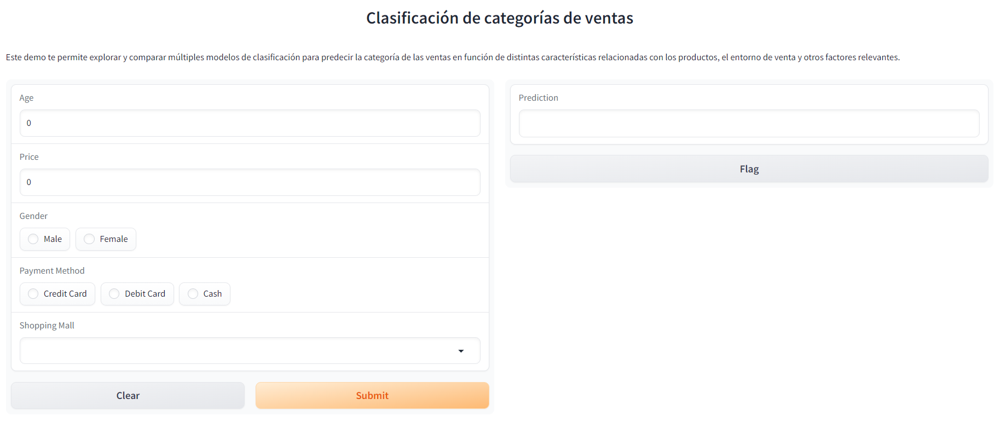

# Monografía presentada para optar al título de Especialista en Analítica y Ciencia de Datos
Este repositorio contiene los notebooks generados en el trabajo de monografía titulada "Predicción de categorías de productos en el sector minorista utilizando técnicas de aprendizaje supervisado ", presentada por Maria del Mar Ipia Guzmán como requisito para obtener el título de Especialista en Analítica y Ciencia de Datos. El trabajo fue desarrollado bajo la asesoría de la Ph.D. Maria Bernarda Salazar Sánchez.

## Resumen
El objetivo de este trabajo es desarrollar un modelo para predecir las categorías de productos en el sector minorista utilizando técnicas de aprendizaje supervisado como herramienta útil para la gestión de inventario y la personalización de recomendaciones en tiendas minoristas. Los notebooks contenidos en este repositorio trabajan con los datos de acceso abierto de Kaggle [Customer Shopping Dataset - Retail Sales Data](https://www.kaggle.com/datasets/mehmettahiraslan/customer-shopping-dataset).

## Descripción del problema
El análisis de datos en el campo de la analítica y ciencia de datos desempeña un papel crucial en la comprensión de los patrones y tendencias dentro de dta set. En este caso particular, se tiene acceso a un conjunto de datos de ventas minoristas que abarca un período de tiempo significativo, desde 2021 hasta 2023, y proporciona información valiosa sobre las transacciones de compras realizadas en 10 tiendas diferentes en Estambul.
Este conjunto de datos es altamente relevante para la realización de análisis en el mercado minorista, ya que contiene una amplia variedad de variables clave, como las identificaciones de los clientes, edad, género, métodos de pago, categorías de productos, cantidad, precio, fechas de pedidos y nombres de las tiendas. Estas características brindan una visión detallada y completa de las transacciones realizadas en el mercado minorista en Estambul.
El objetivo principal de este proyecto de análisis es desarrollar un modelo de aprendizaje supervisado que pueda predecir las categorías de compras en el mercado minorista. Al aprovechar la gran cantidad de datos recopilados, se puede entrenar un modelo que pueda identificar patrones ocultos y relaciones entre las variables, y utilizar esta información para realizar predicciones precisas.
El resultado de este análisis y la implementación exitosa del modelo de aprendizaje supervisado permitirán a las tiendas minoristas en Estambul mejorar su toma de decisiones estratégicas y optimizar sus operaciones. Al comprender mejor las preferencias de los clientes y las categorías de compras, las tiendas podrán adaptar su inventario, estrategias de marketing y promociones para satisfacer las necesidades de los consumidores de manera más efectiva, aumentando así su rentabilidad y competitividad en el mercado.

## Estructura de Notebooks
Los notebooks están organizados en el siguiente orden:
1. **[Obtención de datos](https://github.com/Mdm2016/Monografia-udea-cohorte-5/blob/d1fd8447b6153a4e93bfd389f2dfcd93843fb9e7/entregable_ii/1.obtener_datos.ipynb)**: Este notebook tiene el paso a paso para configurar la API de Kaggle y descargar la data utilizada en el proyecto.
2. **[Analitica descriptiva](https://github.com/Mdm2016/Monografia-udea-cohorte-5/blob/d1fd8447b6153a4e93bfd389f2dfcd93843fb9e7/entregable_ii/2.analitica_descriptiva.ipynb)**: En este notebook realizamos una revisión de los datos
3. **[Preprocesamiento](https://github.com/Mdm2016/Monografia-udea-cohorte-5/blob/d1fd8447b6153a4e93bfd389f2dfcd93843fb9e7/entregable_ii/3.preprocesamiento.ipynb)**: En este notebook se realiza la eliminación de atípicos, creación de nuevas variables y normalización de la información. El archivo `customers_model.csv` alojado es la data resultante luego de finalizado el preprocesamiento y está en la carpeta entregable ii/data del repositorio.
5. **[Etapa de modelado](https://github.com/Mdm2016/Monografia-udea-cohorte-5/blob/d1fd8447b6153a4e93bfd389f2dfcd93843fb9e7/entregable_ii/4.modelos.ipynb)**:

## Dataset
El conjunto de datos "Customer Shopping Dataset" disponible en Kaggle es un conjunto de datos de ventas minoristas que contiene información sobre las transacciones de compras realizadas en 10 tiendas minoristas en Turquía desde el 2021 hasta el 2023 ([url](https://www.kaggle.com/datasets/mehmettahiraslan/customer-shopping-dataset)).

## Despliegue de la aplicación
La aplicación del proyecto se ejecuta sobre 'gradio', en la raiz del proyecto
en el archivo `demo.py`, el cual permite ejectuar una apliación donde se puede
simular datos de ventas y los modelos realizados en el trabajo dan su respectiva
clasificación.

